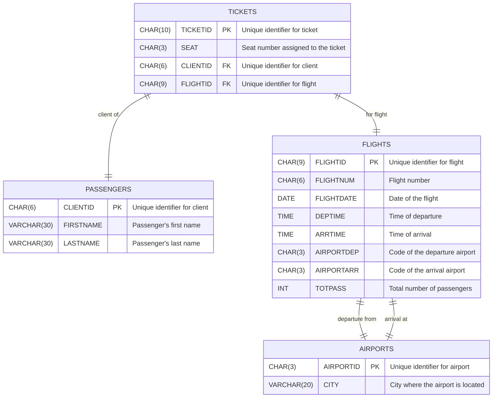

# Database Schema Documentation

This document provides an overview of the database schema, listing each table along with its fields, descriptions, and constraints.

## Table: Employees

- **Intelligible Name**: Employees
- **Description**: Contains information about the employees in the system.

### Fields

| Name in Code | Intelligible Name | Description                | Data Type     | Constraints                      |
|--------------|-------------------|----------------------------|---------------|----------------------------------|
| EMPID        | Employee ID       | Unique identifier for employee | CHAR(8)      | Primary Key, Required, Uppercase Only |
| ADMIDATE     | Admission Date    | Date the employee was admitted | DATE         | Required                        |
| DEPTID       | Department ID     | Identifier for the department | INT          | Required                        |
| PASSWORD     | Password          | Encrypted user password    | CHAR(16)      | Required, Encrypted             |

## Table: Passengers

- **Intelligible Name**: Passengers
- **Description**: Contains information about the passengers.

### Fields

| Name in Code | Intelligible Name | Description                | Data Type     | Constraints                      |
|--------------|-------------------|----------------------------|---------------|----------------------------------|
| CLIENTID     | Client ID         | Unique identifier for client | CHAR(6)      | Primary Key, Required            |
| FIRSTNAME    | First Name        | Passenger's first name     | VARCHAR(30)   | Required, Valid Name             |
| LASTNAME     | Last Name         | Passenger's last name      | VARCHAR(30)   | Required, Valid Name             |

## Table: Flights

- **Intelligible Name**: Flights
- **Description**: Contains information about the flights.

### Fields

| Name in Code | Intelligible Name | Description                | Data Type     | Constraints                      |
|--------------|-------------------|----------------------------|---------------|----------------------------------|
| FLIGHTID     | Flight ID         | Unique identifier for flight | CHAR(9)      | Primary Key, Required            |
| FLIGHTNUM    | Flight Number     | Flight number              | CHAR(6)       | Required                        |
| FLIGHTDATE   | Flight Date       | Date of the flight         | DATE          | Required, Valid Date             |
| DEPTIME      | Departure Time    | Time of departure          | TIME          | Required, Valid Time             |
| ARRTIME      | Arrival Time      | Time of arrival            | TIME          | Required, Valid Time             |
| AIRPORTDEP   | Departure Airport | Code of the departure airport | CHAR(3)     | Required, Valid Airport Codes    |
| AIRPORTARR   | Arrival Airport   | Code of the arrival airport | CHAR(3)      | Required, Valid Airport Codes    |
| TOTPASS      | Total Passengers  | Total number of passengers | INT           | Required, Non-negative           |

## Table: Tickets

- **Intelligible Name**: Tickets
- **Description**: Contains information about the tickets.

### Fields

| Name in Code | Intelligible Name | Description                | Data Type     | Constraints                      |
|--------------|-------------------|----------------------------|---------------|----------------------------------|
| TICKETID     | Ticket ID         | Unique identifier for ticket | CHAR(10)     | Primary Key, Required            |
| SEAT         | Seat Number       | Seat number assigned to the ticket | CHAR(3) | Required                        |
| CLIENTID     | Client ID         | Unique identifier for client | CHAR(6)      | Foreign Key, References PASSENG.CLIENTID |
| FLIGHTID     | Flight ID         | Unique identifier for flight | CHAR(9)      | Foreign Key, References FLIGHT.FLIGHTID |

## Table: Airports

- **Intelligible Name**: Airports
- **Description**: Contains information about airports.

### Fields

| Name in Code | Intelligible Name | Description                | Data Type     | Constraints                      |
|--------------|-------------------|----------------------------|---------------|----------------------------------|
| AIRPORTID    | Airport ID        | Unique identifier for airport | CHAR(3)     | Primary Key, Required, Valid Airport Codes |
| CITY         | City              | City where the airport is located | VARCHAR(20) | Required                        |

## Relationships Diagram

