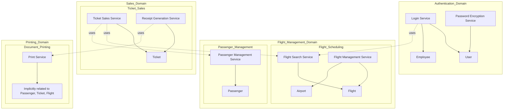

# Domain/Subdomain/Entities/Services Mapping

This document provides an overview of the domain, subdomain, entities, and services mapping for the COBOL project. This approach follows the principles of Domain-Driven Design (DDD) to structure and understand the project more effectively.

## Domains and Subdomains

### 1. Authentication Domain

#### Subdomain: User Authentication
- **Entities**:
  - **[User](../CICS/LOGIN/LOGINMAP)**: Represents a system user who can log in.
  - **[Employee](../CICS/LOGIN/LOGINMAP)**: Represents an employee with specific attributes like department ID and admission date.
- **Services**:
  - **[Login Service](../CICS/LOGIN/LOGIN-COB)**: Handles user login and authentication.
  - **[Password Encryption Service](../CICS/LOGIN/CRYPTO-VERIFICATION)**: Verifies encrypted passwords.

### 2. Flight Management Domain

#### Subdomain: Flight Scheduling
- **Entities**:
  - **[Flight](../DB2/DCLGEN/FLIGHT-DCLGEN)**: Represents flight details including flight number, date, departure, and arrival times.
  - **[Airport](../DB2/DCLGEN/AIRPORT-DCLGEN)**: Represents airport details.
- **Services**:
  - **[Flight Search Service](../CICS/SALES-MAP/SRCHFLY-COB)**: Allows searching for flights based on criteria.
  - **Flight Management Service**: Manages flight details and scheduling.

#### Subdomain: Passenger Management
- **Entities**:
  - **[Passenger](../DB2/DCLGEN/PASSENG-DCLGEN)**: Represents a passenger with details like first name, last name, and client ID.
- **Services**:
  - **[Passenger Management Service](../COB-PROG/PASSENGER-INSERT/PASSENGER-INSERT-MAINPROG)**: Manages passenger information.

### 3. Sales Domain

#### Subdomain: Ticket Sales
- **Entities**:
  - **[Ticket](../DB2/DCLGEN/TICKET-DCLGEN)**: Represents ticket details including seat number, flight ID, and client ID.
- **Services**:
  - **[Ticket Sales Service](../CICS/SALES-MAP/SELL1-COB)**: Handles the selling of tickets, including searching and booking.
  - **[Receipt Generation Service](../CICS/SALES-MAP/RECEIPT-COB)**: Generates sales receipts.

### 4. Printing Domain

#### Subdomain: Document Printing
- **Entities**:
  - **[Implicitly related to Passenger, Ticket, Flight](../CICS/SALES-MAP/PRINT-TICKET-COB)**: No specific entity defined for printing.
- **Services**:
  - **[Print Service](../CICS/SALES-MAP/PRINT-TICKET-COB)**: Manages the printing of tickets and receipts.

## Visual Overview

## Explanation of the Mapping

1. **Authentication Domain**:
   - **Entities**: User and Employee.
   - **Services**: Login Service handles user authentication, and Password Encryption Service verifies passwords.

2. **Flight Management Domain**:
   - **Flight Scheduling**: Manages flights and airports through Flight Search Service and Flight Management Service.
   - **Passenger Management**: Manages passenger information.

3. **Sales Domain**:
   - **Ticket Sales**: Manages ticket sales and receipts through Ticket Sales Service and Receipt Generation Service.

4. **Printing Domain**:
   - **Document Printing**: Manages the printing of tickets and receipts through Print Service. The entities involved are implicitly related to Passenger, Ticket, and Flight.

This structured approach helps to categorize the different parts of the project into coherent domains and subdomains, making it easier to understand and manage.