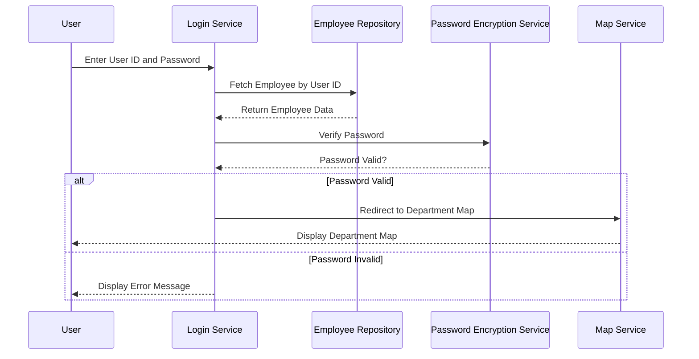

# Feature: Authentication

This document provides a sequence diagram illustrating the authentication process using domain terminology for easier reading.

## Explanation of the Sequence Diagram

1. **User Interaction**:
   - The user enters their User ID and Password and submits them to the [Login Service](../CICS/LOGIN/LOGIN-COB).

2. **Fetching Employee Data**:
   - The [Login Service](../CICS/LOGIN/LOGIN-COB) queries the [Employee Repository](../DB2/DCLGEN/EMPLO-DCLGEN) to fetch the employee data based on the provided User ID.

3. **Password Verification**:
   - The [Login Service](../CICS/LOGIN/LOGIN-COB) uses the [Password Encryption Service](../CICS/LOGIN/CRYPTO-VERIFICATION) to verify if the provided password matches the stored encrypted password.

4. **Handling Authentication Result**:
   - If the password is valid, the [Login Service](../CICS/LOGIN/LOGIN-COB) redirects the user to the appropriate department map using the [Map Service](../CICS/LOGIN/LOGINMAP).
   - If the password is invalid, the [Login Service](../CICS/LOGIN/LOGIN-COB) displays an error message to the user.