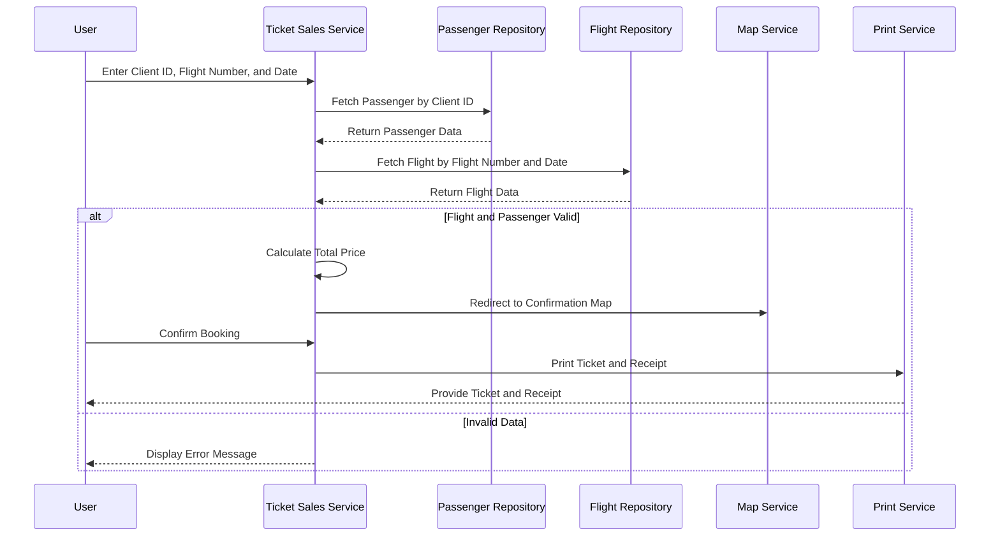

# Feature: Booking a Flight

This document provides a sequence diagram illustrating the process of booking a flight using domain terminology for easier reading.

## Explanation of the Sequence Diagram

1. **User Interaction**:
   - The user enters their Client ID, Flight Number, and Date and submits them to the [Ticket Sales Service](../CICS/SALES-MAP/SELL1-COB).

2. **Fetching Passenger Data**:
   - The [Ticket Sales Service](../CICS/SALES-MAP/SELL1-COB) queries the [Passenger Repository](../DB2/DCLGEN/PASSENG-DCLGEN) to fetch the passenger data based on the provided Client ID.

3. **Fetching Flight Data**:
   - The [Ticket Sales Service](../CICS/SALES-MAP/SELL1-COB) queries the [Flight Repository](../DB2/DCLGEN/FLIGHT-DCLGEN) to fetch the flight data based on the provided Flight Number and Date.

4. **Handling Booking Result**:
   - If both flight and passenger data are valid:
     - The [Ticket Sales Service](../CICS/SALES-MAP/SELL1-COB) calculates the total price.
     - The user is redirected to a confirmation map using the [Map Service](../CICS/SALES-MAP/SELL1-MAP).
     - Upon user confirmation, the [Ticket Sales Service](../CICS/SALES-MAP/SELL1-COB) initiates printing of the ticket and receipt using the [Print Service](../CICS/SALES-MAP/PRINT-TICKET-COB).
     - The [Print Service](../CICS/SALES-MAP/PRINT-TICKET-COB) provides the printed ticket and receipt to the user.
   - If any data is invalid:
     - The [Ticket Sales Service](../CICS/SALES-MAP/SELL1-COB) displays an error message to the user.